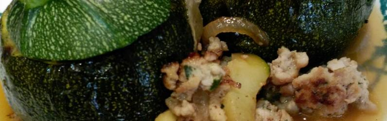

Calabacines rellenos
=======================



## Los ingredientes

* 2 calabacines redondos
* 200 gramos de muslo de pollo picado
* 1/2 cebolla picada
* 1 zanahoria picada
* 1 chorrito de vino blanco
* 8 taquitos de parmesano
* Sal
* Pimienta

*Nota: Ingredientes para 4 personas.*

## El algoritmo

```

1. Cortamos la tapa del calabacin y la guardamos.

2. Con un cuchillo dibujamos un circulo paralelo al contorno del calabacin. Luego con una cuchara vaciamos el interior. Dejamos las paredes gruesas (si la intentas dejar finas se vendrán abajo en el horneado).

3. Poner los calabacines cubiertos por papel de aluminio con un chorrito de aceite en el horno a 250 grados centigrados alrededor de unos 20 minutos.

4. Mientras picamos la cebolla y la zanahoria, y las doramos e una sartén con aceite de oliva.

5. Introducimos en la sartén la carne del calabacin que hemos extraido anteriormente. Rehogamos.

6. Luego vertimos la carne de pollo picada, dejamos que se marque y añadimos un chorrito de vino blanco. Esperamos a que se reduzca.

7. Sacamos los calabacines del horno. Los extraemos con cuidado del papel de plata.

8. Rellenamos con cuidado el hueco con la mezcla que hemos elaborado.

9. Ponemos en la bandeja del horno los calabaciones rellenos, al lado su tapadera y le echamos los taquitos de queso por encima del calabacin relleno.

10. Poner en grill + ventilador a 180 grados centigrados unos 20 minutos,

11. Sacar, emplatar poniendo la tapadera sobre el correspondiente calabacin relleno.

12. A disfrutar!!!

```
