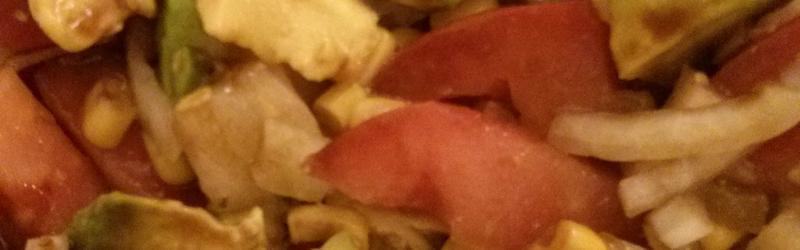

Ensalada Multicolor
=======================

## Los ingredientes

* 1 tomate de ensalada
* 1 aguacate
* 1 cebolla mediana
* 1 lata de maíz dulce
* Queso en dados
* Aceite de oliva
* Vinagre de vino
* Sal

*Nota: Ingredientes para 2 personas.*

*Se recomienda usar el vinagre de vino de la Denominación de Origen Condado de Huelva*

## Paso a paso

1. Cortamos la cebolla en trozos pequeños, el tomate en dados y el aguacate en láminas.
2. Mezclamos todos los ingredientes anteriores junto con la lata de maíz dulce y el queso en dados especial para ensalada.
3. Añadimos sal, vinagre y aceite al gusto.
