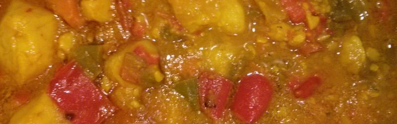

Papas Valentina
=======================

## Los ingredientes

* 5 patatas medianas
* 1 pimiento rojo
* 1 cebolla
* 2 zanahorias
* 3 dientes de ajo
* Salsa Valentina suave
* Colorante alimentario
* Aceite
* Sal

*Nota: ingredientes para dos raciones generosas o tres correctas*

## Paso a paso

1. Pelamos los 3 ajos y los ponemos en el aceite frío en la olla express abierta. Lo ponemos a dorar. Cuando estén bien doraditos los sacamos y los ponemos en un mortero.
2. Echamos picaditas las zanahorias, el pimiento rojo y la cebolla. Rehogamos.
3. Echamos a trozos grandes las patatas. Machamos los ajos y tambien los echamos. Rehogamos.
4. Le ponemos una pizca de sal y le añadimos un chorreón de salsa Valentina. Movemos.
5. Cuidado con la patata! Por el almidón que contiene tienda a pegarse a la superficie, por eso es importante remover.
6. Cuando se haya ligado todo, vertemos agua hasta cubrir la mezcla.
7. Echamos una pizca más de sal y cerramos.
8. Desde que empiece a hervir dejamos que se cueza sólo 15 minutos, para que la patata quede algo dura y podamos terminarla con seguridad una vez se abra la olla.
9. Abrimos después de 15 minutos, verás el acabado muy líquido.
10.  Echamos un buen chorreón de Valentina y una pizca de colorante alimentario. Movemos para que no se queme, hasta que todo termine de ligar. Cuando la patat esté perfectamente cocida, apagamos y dejamos reposar.
11. Voilá!

*Nota: Receta cortesía de [Oh my Tapa!](https://ohmytapa.wordpress.com/)*
