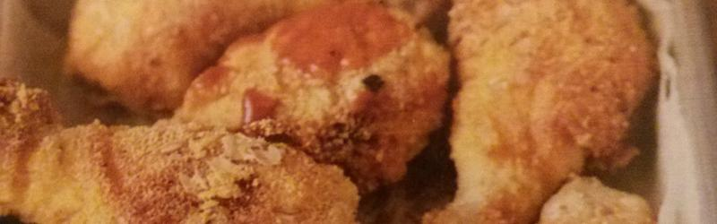

Pollo frito de Kentucky
=======================



## Los recursos

* De 12 a 15 muslitos de pollo sin piel
* 2 cucharadas de sal gruesa
* 500 mililitros de agua
* 1 huevo
* 1/2 cucharadita de pimentón
* 1/2 cucharadita de ajo en polvo
* 130 gramos de harina de maíz
* 30 gramos de copos de avena
* 1 cuchadarita de sal fina
* Pimienta recién molida
* Salsa barbacoa para acompañar
* 1 bolsa de congelación grande o recipiente hermético

*Nota: Recursos para 4 personas.*

## El algoritmo

```

1. Poner a macerar los muslitos en 500ml de agua con la sal gruesa (el agua debe cubrirlos). Dejar en el frigorifico durante una hora.

2. Batir el huevo en un plato hondo junto con el pimenton, el ajo y la pimienta.

3. Secar bien los muslos y pasarlos por el huevo batido.

4. En una bolsa de congelacion o recipiente hermetico, mezclar bien la harina, los copos de avena y la sal.

5. Anadir el pollo, cerrar y sacudir bien para cubrir todos los trozos con el rebozado. Dejar reposar en una rejilla durante 15 minutos.

6. Freir en aceite bien caliente durante unos 25 minutos -o hasta que los muslitos esten dorados- y servir acompañados de salsa barbacoa.

```
